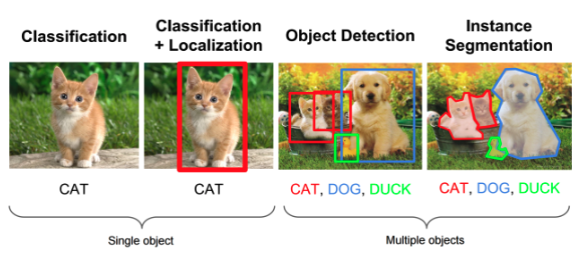

## Project Proposal

### Introduction

Many communities in Africa are regularly impacted by movements of certain wildlife populations. We propose that a machine learning model could be used in coordination with motion-activated camera traps to identify movements of certain wildlife populations and understand when these populations might pose a risk to these communities[[2]](https://doi.org/10.1038/sdata.2015.26).

### Problem Definition

1. Facilitate foreign conservation groups identifying animals.

2. Problems with animal conservation[[3]](https://wedocs.unep.org/bitstream/handle/20.500.11822/22864/WLWL_Report_web.pdf):
   - Human disturbance on habitat and environment
   - Conflict with community and wildlife:
     - Elephants interfere with crops, community harms elephants
     - Lions getting close to communities
   - Large areas that require a lot of manpower to keep track of
   - **When** and **Where** are the wildlife population?
   - Focusing on African Wildlife. Can be apply to any wildlife in any habitat with training?
   - Help with identification/tracking of animals in an area, estimation of population. Automize of data analytics to feed into other programs.
   - Create a network of cameras that can be maintained by the community. Whenever the camera is triggered by motion, an image is taken

### Methods

The main approach is object detection applied to wildlife images[[1]](http://www.eng.auburn.edu/~troppel/internal/sparc/TourBot/TourBot%20References/Haar/2000186.pdf). The project plan to use datasets including 1500-image Kaggle data set from Google search[[4]](https://www.kaggle.com/biancaferreira/african-wildlife) and a research dataset from camera traps[[2]](https://doi.org/10.1038/sdata.2015.26). The Kaggle dataset is pre-labeled with corresponding animal type and coordinates which means it is ready to be trained with supervised learning. The supervised learning algorithm deep neural network with frameworks such as VGG and pre-trained Darknet YOLO v4 model will be implemented and parameters will be adjusted based on features and performance. The research dataset likely requires a prior step like classification algorithm such as KMeans for localizing and segmenting animals from the images and then cluster similar animals together. Because of the visual similarity of animals, colour, patterns and size are all relevant useful features. Therefore, images will be pre-processed to extract features all of them and convert to a consistent format.

### Potential Results

We expect our potential results to be accurate categorization of animals detected in the camera as well as an expected distance between the animal and the camera.

Our algorithm will firest detect movement of objects and classify animal movement from non-animal movement. If an animal is detected, the algorithm will accurately provide the animal species. Our results will focus on the 4 animals including: elephant, buffalo, rhino, and zebra. We will enlarge our results to include more wildlife animals if we have time. Concurrently, the algorithm will also provide an approximation of how far the animal is to the camera.

### Discussion

Our program will detect the animal in the image and catalogue it. This data will be used for the position of the animal to inform the community if any actions needs to be taken. For example, if an elephant is detected near a crop field, inform the community to re-enforce the walls around the field. If a lion is detected near a settlement, inform the community to increase the guard shifts.

This data will also allow conservation groups to keep track of animal population in an area without constantly disturbing the environment.

The trained ML model will be evaluated for its accuracy and we aim to achieve at least 95% accuracy. The erros will be looked at and evaluated as why it might be the cause, for example, due to colour or shape similarity.

### References

1. Tilo, B., Janko, C., & Barry, T. T. (2004). Tracking Animals in Wildlife Videos Using Face Detection. EWIMT, 1-8.
2. Swanson, A., et al. (2015). Snapshot Serengeti, high-frequency annotated camera trap images of 40 mammalian species in an African savanna. Scientific Data, 2.
3. Cooney, R., et al. (2018). Wildlife, Wild Livelihoods: Involving Communities in Sustainable Wildlife Management and Combatting the Illegal Wildlife Trade. United Nations Environment Programme, Nairobi, Kenya.
4. Ferreira, B. (2020). African wildlife (Version 1) [Data set]. Kaggle.
